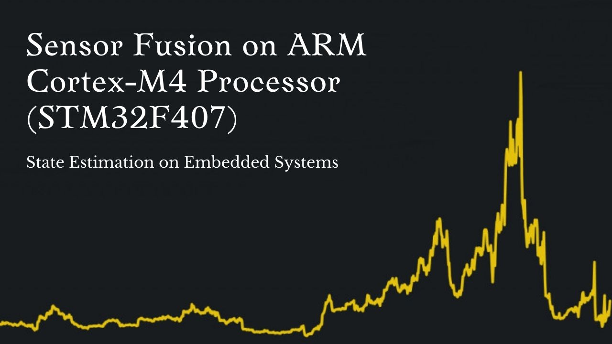

## Sensor Fusion on ARM Cortex-M4 (STM32F4)

### Projects
~~~
1. Tracking with Kalman Filter
2. Estimation with Recursive Least Squares
3. Estimating Passive Suspension with Kalman Filter
~~~

### Tools & Libraries
~~~
IDE :  Keil uVision 5
RTOS :  FreeRTOS
Programming Language : 	C++ 14
Library : ARM CMSIS DSP
Library : LwIP for Socket Programming		
~~~

### Demonstration Video on Youtube (click the image to show the Video on Youtube)

### References
~~~
1. H∞ control of active vehicle suspensions with actuator time delay, 
	Haiping Du, Nong Zhang, 2007
2. Output-Feedback-Based H∞ Control for Vehicle Suspension Systems 
	With Control Delay, Hongyi Li, Xingjian Jing, and Hamid Reza Karimi, 2014
~~~